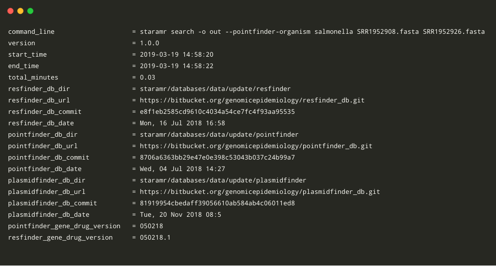
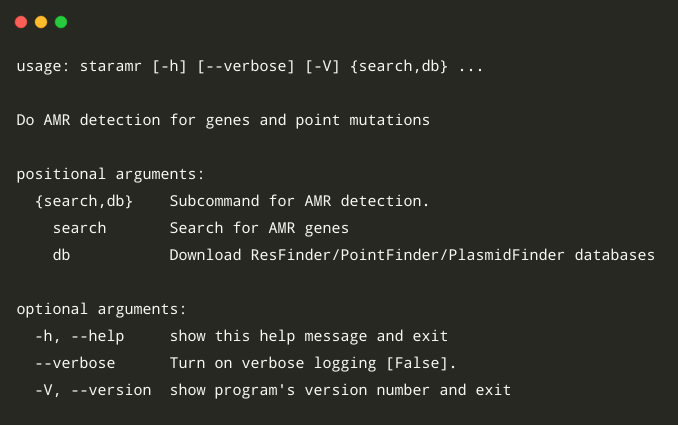
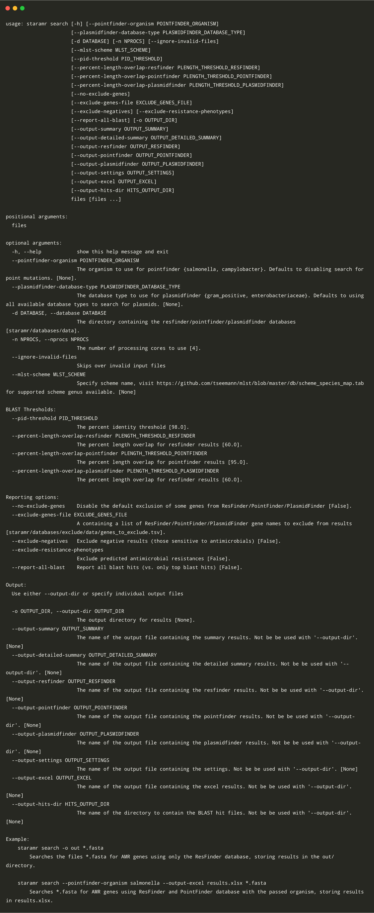
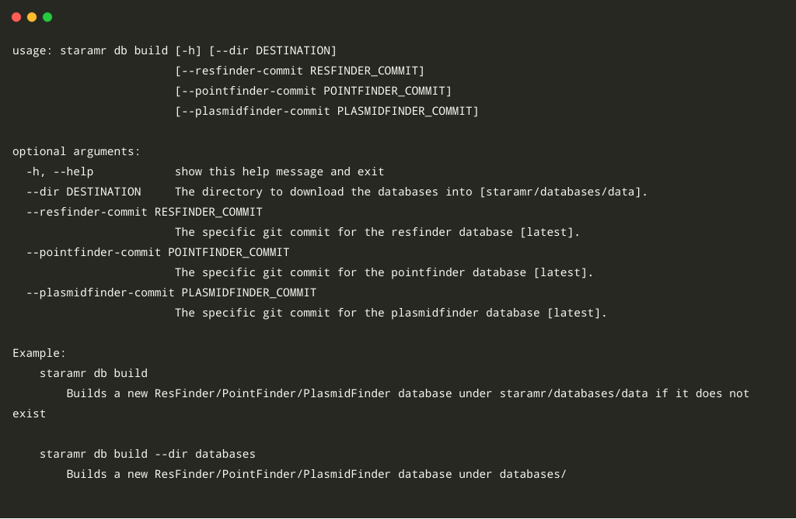
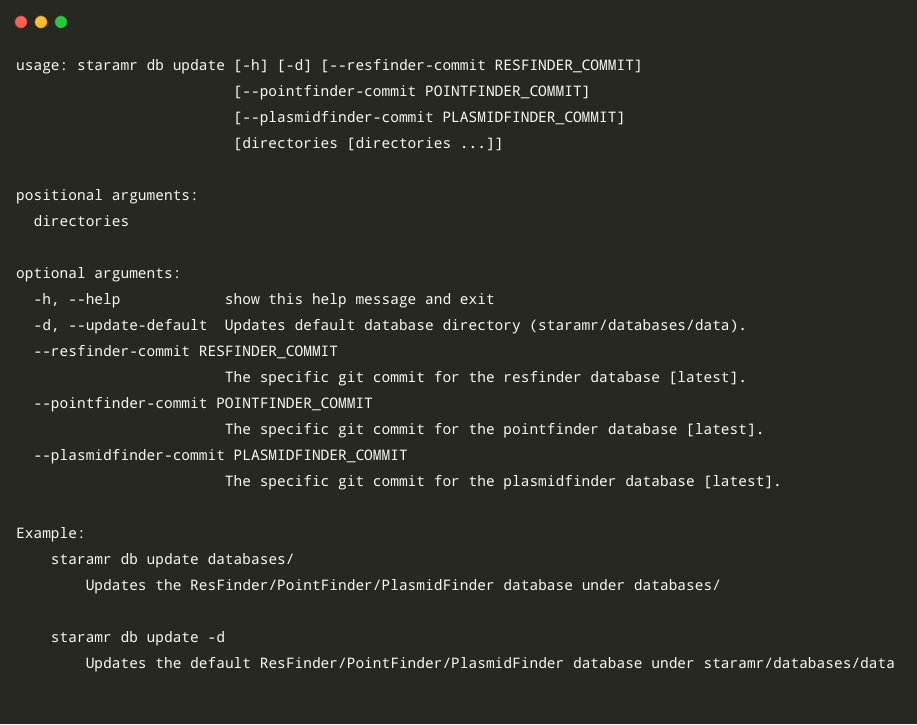
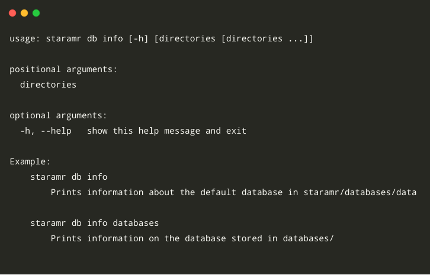
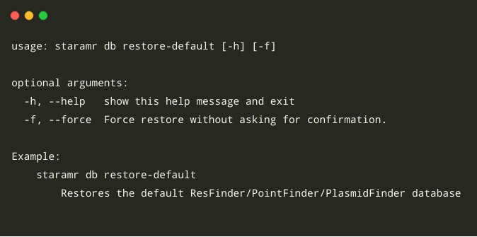

[](https://travis-ci.org/phac-nml/staramr)
[](https://pypi.python.org/pypi/staramr/)
[](https://anaconda.org/bioconda/staramr)

# `staramr`

`staramr` (*AMR) scans bacterial genome contigs against the [ResFinder][resfinder-db], [PointFinder][pointfinder-db], and [PlasmidFinder][plasmidfinder-db] databases (used by the [ResFinder webservice][resfinder-web] and other webservices offered by the Center for Genomic Epidemiology) and compiles a summary report of detected antimicrobial resistance genes.

**Note: The predicted phenotypes/drug resistances are for microbiological resistance and *not* clinical resistance. This is provided with support from the NARMS/CIPARS Molecular Working Group and is continually being improved. A small comparison between phenotype/drug resistance predictions produced by `staramr` and those available from NCBI can be found in the [tutorial][tutorial]. We welcome any feedback or suggestions.**

For example:

```
staramr search -o out --pointfinder-organism salmonella *.fasta
```

**out/summary.tsv**:

| Isolate ID | Genotype                                                  | Predicted Phenotype                                                                                       | Plasmid Genes                       |
|------------|-----------------------------------------------------------|-----------------------------------------------------------------------------------------------------------| ------------------------------------|
| SRR1952908 | aadA1, aadA2, blaTEM-57, cmlA1, gyrA (S83Y), sul3, tet(A) | streptomycin, ampicillin, chloramphenicol, ciprofloxacin I/R, nalidixic acid, sulfisoxazole, tetracycline | ColpVC, IncFIB(S), IncFII(S), IncI1 |
| SRR1952926 | blaTEM-57, gyrA (S83Y), tet(A)                            | ampicillin, ciprofloxacin I/R, nalidixic acid, tetracycline                                               | ColpVC, IncFIB(S), IncFII(S), IncI1 |

**out/detailed_summary.tsv**:

| Isolate ID | Gene        | Predicted Phenotype               | %Identity | %Overlap | HSP Length/Total Length | Contig      | Start  | End    | Accession | Data Type  |
|------------|-------------|-----------------------------------|-----------|----------|-------------------------|-------------|--------|--------|-----------|------------|
| SRR1952908 | ColpVC      |                                   | 98.96     | 100      | 193/193                 | contig00038 | 1618   | 1426   | JX133088  | Plasmid    |
| SRR1952908 | sul3        | sulfisoxazole                     | 100       | 100      | 792/792                 | contig00030 | 2091   | 2882   | AJ459418  | Resistance |

**out/resfinder.tsv**:

| Isolate ID | Gene       | Predicted Phenotype  | %Identity  | %Overlap  | HSP Length/Total Length  | Contig       | Start  | End   | Accession |
|------------|------------|----------------------|------------|-----------|--------------------------|--------------|--------|-------|-----------|
| SRR1952908 | sul3       | sulfisoxazole        | 100.00     | 100.00    | 792/792                  | contig00030  | 2091   | 2882  | AJ459418  |
| SRR1952908 | tet(A)     | tetracycline         | 99.92      | 100.00    | 1200/1200                | contig00032  | 1551   | 2750  | AJ517790  |

**out/pointfinder.tsv**:

| Isolate ID  | Gene         | Predicted Phenotype                | Type   | Position  | Mutation             | %Identity  | %Overlap  | HSP Length/Total Length  | Contig       | Start   | End    |
|-------------|--------------|------------------------------------|--------|-----------|----------------------|------------|-----------|--------------------------|--------------|---------|--------|
| SRR1952908  | gyrA (S83Y)  | ciprofloxacin I/R, nalidixic acid  | codon  | 83        | TCC -> TAC (S -> Y)  | 99.96      | 100.00    | 2637/2637                | contig00008  | 22801   | 20165  |
| SRR1952926  | gyrA (S83Y)  | ciprofloxacin I/R, nalidixic acid  | codon  | 83        | TCC -> TAC (S -> Y)  | 99.96      | 100.00    | 2637/2637                | contig00011  | 157768  | 160404 |

**out/plasmidfinder.tsv**:

| Isolate ID | Gene      | %Identity | %Overlap | HSP Length/Total Length | Contig      | Start | End   | Accession |
|------------|-----------|-----------|----------|-------------------------|-------------|-------|-------|-----------|
| SRR1952908 | ColpVC    | 98.96     | 100      | 193/193                 | contig00038 | 1618  | 1426  | JX133088  |
| SRR1952908 | IncFIB(S) | 98.91     | 100      | 643/643                 | contig00024 | 10302 | 9660  | FN432031  |

# Table of Contents

- [Quick Usage](#quick-usage)
  * [Search contigs](#search-contigs)
  * [Database Info](#database-info)
  * [Update Database](#update-database)
  * [Restore Database](#restore-database)
- [Installation](#installation)
  * [Bioconda](#bioconda)
  * [PyPI/Pip](#pypipip)
  * [Latest Code](#latest-code)
  * [Dependencies](#dependencies)
- [Output](#output)
  * [summary.tsv](#summarytsv)
  * [resfinder.tsv](#resfindertsv)
  * [pointfinder.tsv](#pointfindertsv)
  * [settings.txt](#settingstxt)
  * [hits/](#hits)
- [Tutorial](#tutorial)
- [Usage](#usage)
  * [Main Command](#main-command)
  * [Search](#search)
  * [Database Build](#database-build)
  * [Database Update](#database-update)
  * [Database Info](#database-info-1)
  * [Database Restore Default](#database-restore-default)
- [Caveats](#caveats)
- [Acknowledgements](#acknowledgements)
- [Citations](#citations)
- [Legal](#legal)

# Quick Usage

## Search contigs

To search a list of contigs (in **fasta** format) for AMR genes using ResFinder please run:

```bash
staramr search -o out *.fasta
```

Output files will be located in the directory `out/`.

To include acquired point-mutation resistances using PointFinder, please run:

 ```bash
staramr search --pointfinder-organism salmonella -o out *.fasta
```

Where `--pointfinder-organism` is the specific organism you are interested in (currently only *salmonella* and *campylobacter* are supported).

To specify which PlasmidFinder database to use, please run:

```bash
staramr search --plasmidfinder-database-type enterobacteriaceae -o out *.fasta
```
Where `--plasmidfinder-database-type` is the specific database type you are interested in (currently only *gram_positive*, *enterobacteriaceae* are supported). By default, both databases are used.

## Database Info

To print information about the installed databases, please run:

```
staramr db info
```

## Update Database

If you wish to update to the latest ResFinder, PointFinder, and PlasmidFinder databases, you may run:

```bash
staramr db update --update-default
```

If you wish to switch to specific git commits of either ResFinder, PointFinder, or PlasmidFinder databases you may also pass `--resfinder-commit [COMMIT]`, `--pointfinder-commit [COMMIT]`, and `--plasmidfinder-commit [COMMIT]`.

## Restore Database

If you have updated the ResFinder/PointFinder/PlasmidFinder databases and wish to restore to the default version, you may run:

```
staramr db restore-default
```

# Installation

## Bioconda

The easiest way to install `staramr` is through [Bioconda][bioconda].

```bash
conda install -c bioconda staramr
```

This will install the `staramr` Python package as well as all necessary dependencies and databases.  You can now run:

```bash
staramr --help
```

If you wish to use `staramr` in an isolated environment (in case dependencies conflict) you may alternatively install with:

```bash
conda create -c bioconda --name staramr staramr
```

To run `staramr` in this case, you must first activate the environment.  That is:

```bash
source activate staramr
staramr --help
```

## PyPI/Pip

You can also install `staramr` from [PyPI][pypi-staramr] using `pip`:

```
pip install staramr
```

However, you will have to install the external dependencies (listed below) separately.

## Latest Code

If you wish to make use of the latest in-development version of `staramr`, you may update directly from GitHub using `pip`:

```bash
pip install git+https://github.com/phac-nml/staramr
```

This will only install the Python code, you will still have to install the dependencies listed below (or run the `pip` command from the previously installed Bioconda environment).

Alternatively, if you wish to do development with `staramr` you can use a Python virtual environment (you must still install the non-Python dependencies separately).

```bash
# Clone code
git clone https://github.com/phac-nml/staramr.git
cd staramr

# Setup virtual environment
virtualenv -p /path/to/python-bin .venv
source .venv/bin/activate

# Install staramr. Use '-e' to update the install on code changes.
pip install -e .

# Now run `staramr`
staramr 
```

Due to the way we packaged the ResFinder/PointFinder/PlasmidFinder databases, the development code will not come with a default database. You must first build the database before usage. E.g.

```
staramr db restore-default
```

## Dependencies

* Python 3.5+
* BLAST+
* Git

# Input

## List of genes to exclude

By default, the ResFinder/PointFinder/PlasmidFinder genes listed in [genes_to_exclude.tsv][] will be excluded from the final results. To pass a custom list of genes the option `--exclude-genes-file` can be used, where the file specified will contains a list of the sequence ids (one per line) from the ResFinder/PointFinder/PlasmidFinder databases. For example:

```
#gene_id
aac(6')-Iaa_1_NC_003197
ColpVC_1__JX133088
```

Please make sure to include `#gene_id` in the first line. The default exclusion list can also be disabled with `--no-exclude-genes`.

# Output

There are 7 different output files produced by `staramr`:

1. `summary.tsv`:  A summary of all detected AMR genes/mutations/plasmids in each genome, one genome per line.
2. `detailed_summary.tsv`: A detailed summary of all detected AMR genes/mutations/plasmids in each genome, one gene per line.
3. `resfinder.tsv`: A tabular file of each AMR gene and additional BLAST information from the **ResFinder** database, one gene per line.
4. `pointfinder.tsv`: A tabular file of each AMR point mutation and additional BLAST information from the **PointFinder** database, one gene per line.
5. `plasmidfinder.tsv`: A tabular file of each AMR plasmid gene and additional BLAST information from the **PlasmidFinder** database, one plasmid gene per line.
6. `settings.txt`: The command-line, database versions, and other settings used to run `staramr`.
7. `results.xlsx`: An Excel spreadsheet containing the previous 6 files as separate worksheets.

In addition, the directory `hits/` stores fasta files of the specific blast hits.

## summary.tsv

The **summary.tsv** output file generated by `staramr` contains the following columns:

* __Isolate ID__: The id of the isolate/genome file(s) passed to `staramr`.
* __Genotype__: The AMR genotype of the isolate.
* __Predicted Phenotype__: The predicted AMR phenotype (drug resistances) for the isolate.

### Example

| Isolate ID | Genotype                                                  | Predicted Phenotype                                                                                       |
|------------|-----------------------------------------------------------|-----------------------------------------------------------------------------------------------------------|
| SRR1952908 | aadA1, aadA2, blaTEM-57, cmlA1, gyrA (S83Y), sul3, tet(A) | streptomycin, ampicillin, chloramphenicol, ciprofloxacin I/R, nalidixic acid, sulfisoxazole, tetracycline |
| SRR1952926 | blaTEM-57, gyrA (S83Y), tet(A)                            | ampicillin, ciprofloxacin I/R, nalidixic acid, tetracycline                                               |

## detailed_summary.tsv

The **detailed_summary.tsv** output file generated by `staramr` contains the following columns:

* __Isolate ID__: The id of the isolate/genome file(s) passed to `staramr`.
* __Gene__: The particular gene detected from ResFinder, PlasmidFinder, and PointFinder.
* __Predicted Phenotype__: The predicted AMR phenotype (drug resistances) found in ResFinder/PointFinder. Plasmid genes will be left blank by default.
* __%Identity__: The % identity of the top BLAST HSP to the gene.
* __%Overlap__: THe % overlap of the top BLAST HSP to the gene (calculated as __hsp length/total length * 100__).
* __HSP Length/Total Length__ The top BLAST HSP length over the gene total length (nucleotides).
* __Contig__: The contig id containing this gene.
* __Start__: The start of the gene (will be greater than __End__ if on minus strand).
* __End__: The end of the gene.
* __Accession__: The accession of the gene from either ResFinder or PlasmidFinder  database.
* __Data Type__: The type of gene it is either a **Resistance** gene or a **Plasmid** gene

### Example
| Isolate ID | Gene        | Predicted Phenotype               | %Identity | %Overlap | HSP Length/Total Length | Contig      | Start  | End    | Accession | Data Type  |
|------------|-------------|-----------------------------------|-----------|----------|-------------------------|-------------|--------|--------|-----------|------------|
| SRR1952926 | IncI1       |                                   | 100       | 100      | 142/142                 | contig00017 | 3907   | 3766   | AP005147  | Plasmid    |
| SRR1952926 | blaTEM-57   | ampicillin                        | 99.88     | 100      | 861/861                 | contig00027 | 6176   | 5316   | FJ405211  | Resistance |

## resfinder.tsv

The **resfinder.tsv** output file generated by `staramr` contains the following columns:

* __Isolate ID__: The id of the isolate/genome file(s) passed to `staramr`.
* __Gene__: The particular AMR gene detected.
* __Predicted Phenotype__: The predicted AMR phenotype (drug resistances) for this gene.
* __%Identity__: The % identity of the top BLAST HSP to the AMR gene.
* __%Overlap__: THe % overlap of the top BLAST HSP to the AMR gene (calculated as __hsp length/total length * 100__).
* __HSP Length/Total Length__ The top BLAST HSP length over the AMR gene total length (nucleotides).
* __Contig__: The contig id containing this AMR gene.
* __Start__: The start of the AMR gene (will be greater than __End__ if on minus strand).
* __End__: The end of the AMR gene.
* __Accession__: The accession of the AMR gene in the ResFinder database.

### Example

| Isolate ID | Gene       | Predicted Phenotype  | %Identity  | %Overlap  | HSP Length/Total Length  | Contig       | Start  | End   | Accession |
|------------|------------|----------------------|------------|-----------|--------------------------|--------------|--------|-------|-----------|
| SRR1952908 | sul3       | sulfisoxazole        | 100.00     | 100.00    | 792/792                  | contig00030  | 2091   | 2882  | AJ459418  |
| SRR1952908 | tet(A)     | tetracycline         | 99.92      | 100.00    | 1200/1200                | contig00032  | 1551   | 2750  | AJ517790  |

## pointfinder.tsv

The **pointfinder.tsv** output file generated by `staramr` contains the following columns:

* __Isolate ID__: The id of the isolate/genome file(s) passed to `staramr`.
* __Gene__: The particular AMR gene detected, with the point mutation within *()*.
* __Predicted Phenotype__: The predicted AMR phenotype (drug resistances) for this gene.
* __Type__: The type of this mutation from PointFinder (either **codon** or **nucleotide**).
* __Position__: The position of the mutation. For **codon** type, the position is the codon number in the gene, for **nucleotide** type it is the nucleotide number.
* __Mutation__: The particular mutation. For **codon** type lists the codon mutation, for **nucleotide** type lists the single nucleotide mutation.
* __%Identity__: The % identity of the top BLAST HSP to the AMR gene.
* __%Overlap__: The % overlap of the top BLAST HSP to the AMR gene (calculated as __hsp length/total length * 100__).
* __HSP Length/Total Length__ The top BLAST HSP length over the AMR gene total length (nucleotides).
* __Contig__: The contig id containing this AMR gene.
* __Start__: The start of the AMR gene (will be greater than __End__ if on minus strand).
* __End__: The end of the AMR gene.

### Example

| Isolate ID  | Gene         | Predicted Phenotype                | Type   | Position  | Mutation             | %Identity  | %Overlap  | HSP Length/Total Length  | Contig       | Start   | End    |
|-------------|--------------|------------------------------------|--------|-----------|----------------------|------------|-----------|--------------------------|--------------|---------|--------|
| SRR1952908  | gyrA (S83Y)  | ciprofloxacin I/R, nalidixic acid  | codon  | 83        | TCC -> TAC (S -> Y)  | 99.96      | 100.00    | 2637/2637                | contig00008  | 22801   | 20165  |
| SRR1952926  | gyrA (S83Y)  | ciprofloxacin I/R, nalidixic acid  | codon  | 83        | TCC -> TAC (S -> Y)  | 99.96      | 100.00    | 2637/2637                | contig00011  | 157768  | 160404 |

## plasmidfinder.tsv

The **plasmidfinder.tsv** output file generated by `staramr` contains the following columns:

* __Isolate ID__: The id of the isolate/genome file(s) passed to `staramr`.
* __Gene__: The particular plasmid gene detected.
* __%Identity__: The % identity of the top BLAST HSP to the plasmid gene.
* __%Overlap__: The % overlap of the top BLAST HSP to the plasmid gene (calculated as __hsp length/total length * 100__).
* __HSP Length/Total Length__ The top BLAST HSP length over the plasmid gene total length (nucleotides).
* __Contig__: The contig id containing this plasmid gene.
* __Start__: The start of the plasmid gene (will be greater than __End__ if on minus strand).
* __End__: The end of the plasmid gene.
* __Accession__: The accession of the plasmid gene in the PlasmidFinder database.

### Example

| Isolate ID | Gene      | %Identity | %Overlap | HSP Length/Total Length | Contig      | Start | End   | Accession |
|------------|-----------|-----------|----------|-------------------------|-------------|-------|-------|-----------|
| SRR1952908 | ColpVC    | 98.96     | 100      | 193/193                 | contig00038 | 1618  | 1426  | JX133088  |
| SRR1952908 | IncFIB(S) | 98.91     | 100      | 643/643                 | contig00024 | 10302 | 9660  | FN432031  |

## settings.txt

The **settings.txt** file contains the particular settings used to run `staramr`.

* __command_line__: The command line used to run `staramr`.
* __version__: The version of `staramr`.
* __start_time__,__end_time__,__total_minutes__: The start, end, and duration for running `staramr`.
* __resfinder_db_dir__, __pointfinder_db_dir__, __plasmidfinder_db_dir__ : The directory containing the ResFinder, PointFinder, and PlasmidFinder databases.
* __resfinder_db_url__, __pointfinder_db_url__, __plasmidfinder_db_url__: The URL to the git repository for the ResFinder, PointFinder, and PlasmidFinder databases.
* __resfinder_db_commit__, __pointfinder_db_commit__, __plasmidfinder_db_commit__: The git commit ids for the ResFinder, PointFinder, and PlasmidFinder databases.
* __resfinder_db_date__, __pointfinder_db_date__, __plasmidfinder_db_date__: The date of the git commits of the ResFinder, PointFinder, and PlasmidFinder databases.
* __pointfinder_gene_drug_version__, __resfinder_gene_drug_version__: A version identifier for the gene/drug mapping table used by `staramr`.

### Example



## hits/

The **hits/** directory contains the BLAST HSP nucleotides for the entries listed in the **resfinder.tsv** and **pointfinder.tsv** files. There are up to two files per input genome, one for ResFinder and one for PointFinder.

For example, with an input genome named **SRR1952908.fasta** there would be two files `hits/resfinder_SRR1952908.fasta` and `hits/pointfinder_SRR1952908.fasta`. These files contain mostly the same information as in the **resfinder.tsv**, **pointfinder.tsv**, and **plasmidfinder.tsv** files. Additional information is the **database_gene_start** and **database_gene_end** listing the start/end of the BLAST HSP on the AMR resistance gene from the ResFinder/PointFinder/PlasmidFinder databases. 

### Example

```
>aadA1_3_JQ414041 isolate: SRR1952908, contig: contig00030, contig_start: 5355, contig_end: 4564, database_gene_start: 1, database_gene_end: 792, hsp/length: 792/792, pid: 100.00%, plength: 100.00%
ATGAGGGAAGCGGTGATCGCCGAAGTATCGACTCAACTATCAGAGGTAGTTGGCGTCATC
GAGCGCCATCTCGAACCGACGTTGCTGGCCGTACATTTGTACGGCTCCGCAGTGGATGGC
...
```

# Tutorial

A tutorial guiding you though the usage of `staramr`, interpreting the results, and comparing with antimicrobial resistances available on NCBI can be found at [staramr tutorial][tutorial].

# Usage

## Main Command

Main `staramr` command. Can be used to set global options (primarily `--verbose`).



## Search

Searches input FASTA files for AMR genes.



## Database Build

Downloads and builds the ResFinder, PointFinder, and PlasmidFinder databases.



## Database Update

Updates an existing download of the ResFinder, PointFinder, and PlasmidFinder databases.



## Database Info

Prints information about an existing build of the ResFinder/PointFinder/PlasmidFinder databases.



## Database Restore Default

Restores the default database for `staramr`.



# Caveats

This software is still a work-in-progress.  In particular, not all organisms stored in the PointFinder database are supported (only *salmonella* and *campylobacter* are currently supported). Additionally, the predicted phenotypes are for microbiological resistance and *not* clinical resistance. Phenotype/drug resistance predictions are an experimental feature which is continually being improved.

`staramr` only works on assembled genomes and not directly on reads. A quick genome assembler you could use is [Shovill][shovill]. Or, you may also wish to try out the [ResFinder webservice][resfinder-web],  or the command-line tools [rgi][] or [ariba][] which will work on sequence reads as well as genome assemblies.  You may also wish to check out the [CARD webservice][card-web]. 

# Acknowledgements

Some ideas for the software were derived from the [ResFinder][resfinder-git], [PointFinder][pointfinder-git], and [PlasmidFinder][plasmidfinder-git] command-line software, as well as from [ABRicate][abricate].

Phenotype/drug resistance predictions are provided with support from the NARMS/CIPARS Molecular Working Group. 

# Citations

If you find `staramr` useful, please consider citing this GitHub repository (https://github.com/phac-nml/staramr) as well as the original ResFinder, PointFinder, and PlasmidFinder publications.

> **Zankari E, Hasman H, Cosentino S, Vestergaard M, Rasmussen S, Lund O, Aarestrup FM, Larsen MV**. 2012. Identification of acquired antimicrobial resistance genes. J. Antimicrob. Chemother. 67:2640–2644. doi: [10.1093/jac/dks261][resfinder-cite]

> **Zankari E, Allesøe R, Joensen KG, Cavaco LM, Lund O, Aarestrup F**. PointFinder: a novel web tool for WGS-based detection of antimicrobial resistance associated with chromosomal point mutations in bacterial pathogens. J Antimicrob Chemother. 2017; 72(10): 2764–8. doi: [10.1093/jac/dkx217][pointfinder-cite]

> **Carattoli A, Zankari E, Garcia-Fernandez A, Voldby Larsen M, Lund O, Villa L, Aarestrup FM, Hasman H**. PlasmidFinder and pMLST: in silico detection and typing of plasmids. Antimicrob. Agents Chemother. 2014. April 28th. doi: [10.1128/AAC.02412-14][plasmidfinder-cite]

# Legal

Copyright 2018 Government of Canada

Licensed under the Apache License, Version 2.0 (the "License"); you may not use
this work except in compliance with the License. You may obtain a copy of the
License at:

http://www.apache.org/licenses/LICENSE-2.0

Unless required by applicable law or agreed to in writing, software distributed
under the License is distributed on an "AS IS" BASIS, WITHOUT WARRANTIES OR
CONDITIONS OF ANY KIND, either express or implied. See the License for the
specific language governing permissions and limitations under the License.

[resfinder-db]: https://bitbucket.org/genomicepidemiology/resfinder_db
[pointfinder-db]: https://bitbucket.org/genomicepidemiology/pointfinder_db
[plasmidfinder-db]:https://bitbucket.org/genomicepidemiology/plasmidfinder_db
[resfinder-web]: https://cge.cbs.dtu.dk/services/ResFinder/
[resfinder-cite]: https://dx.doi.org/10.1093/jac/dks261
[pointfinder-cite]: https://doi.org/10.1093/jac/dkx217
[plasmidfinder-cite]: https://doi.org/10.1128/AAC.02412-14
[Bioconda]: https://bioconda.github.io/
[requirements.txt]: requirements.txt
[resfinder-git]: https://bitbucket.org/genomicepidemiology/resfinder
[pointfinder-git]: https://bitbucket.org/genomicepidemiology/pointfinder-3.0
[plasmidfinder-git]: https://bitbucket.org/genomicepidemiology/plasmidfinder
[abricate]: https://github.com/tseemann/abricate
[shovill]: https://github.com/tseemann/shovill
[ariba]: https://github.com/sanger-pathogens/ariba
[rgi]: https://github.com/arpcard/rgi
[pypi-staramr]: https://pypi.org/project/staramr/
[bioconda]: https://bioconda.github.io/
[card-web]: https://card.mcmaster.ca/
[tutorial]: doc/tutorial/staramr-tutorial.ipynb
[genes_to_exclude.tsv]: staramr/databases/exclude/data/genes_to_exclude.tsv
